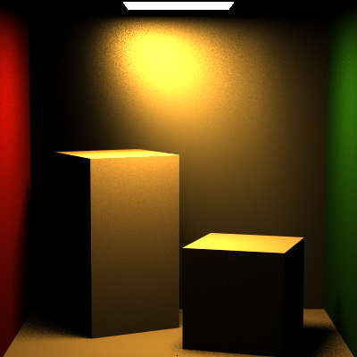

# Monte Carlo Path Tracer Renders

## Direct Lighting Estimation

## Global Illumination using Full Lighting Integrator

## Custom Scenes

## Veach Lighting Scene (Light Sampling Techniques on Different Microfacet Surfaces)

## Thin Lens Camera

